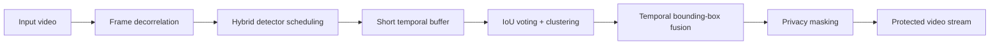

# MBAM

## When One Frame Slips, the Others Have Its Back: A Latency-First Multi-Frame Video Object Masking

> [!IMPORTANT]
> 🚧 **Code release coming soon.** We are currently cleaning and packaging the implementation, configurations, and reproducibility instructions for public release.
>
> If you found this project through **IROS 2026**, please ⭐ **Star this repository** or **Watch → Releases** so you can easily find it again when the code is posted.

**Accepted at [2026 IEEE/RSJ International Conference on Intelligent Robots and Systems (IROS)](https://2026.ieee-iros.org/program/contributed_talks/#d03330:3399)**  
Pittsburgh, Pennsylvania, USA | September 27 - October 1, 2026  
**IROS 2026 Poster:** E13

**Hossein Khalili¹, Fan Zhang¹, Kittipat Apicharttrisorn², Nader Sehatbakhsh¹**  
¹ University of California, Los Angeles (UCLA)  
² Nokia Bell Labs

[**SsysArch Lab**](https://ssysarch.ee.ucla.edu/index.html) · [**Hossein Khalili**](https://www.hosseinhkh.com/)

---

## TL;DR

Privacy-preserving robotic video systems often detect and mask sensitive regions independently in every frame. That creates a difficult tradeoff: lightweight detectors are fast but can miss faces, while stronger detectors improve recall but are expensive to run on every frame.

**MBAM (Multi-frame Bounding-box Aggregation Masking)** takes a latency-first approach. Instead of requiring every frame to be detected perfectly, MBAM uses information from a short temporal window so that a successful detection in a neighboring frame can recover an isolated miss. It combines:

1. **Temporal window fusion** to aggregate detections across nearby frames.
2. **Frame decorrelation** through temporal skipping and resolution variation.
3. **Hybrid detector scheduling** that periodically uses a high-recall detector while lightweight detectors process intermediate frames.

The goal is to jointly preserve **privacy, visual utility, and low latency** on resource-constrained robotic hardware.

---

## Motivation

Robots, autonomous vehicles, delivery platforms, and smart cameras continuously capture video. These streams may contain faces and other privacy-sensitive information before they are stored or transmitted.

A single missed detection can matter. Even if a face is masked in almost every frame, one clear frame may still expose identity. Running a strong detector on every frame can reduce misses, but it also increases latency and compute cost.

MBAM asks a different question:

> **Can neighboring frames have each other's back when one frame slips?**

Video naturally contains short-term temporal redundancy. MBAM exploits that redundancy to recover intermittent detection failures without paying the cost of heavyweight inference on every frame.

---

## How MBAM Works



### 1. Temporal window fusion

MBAM maintains a short temporal buffer and aggregates bounding boxes from neighboring frames. If a sensitive object is detected in at least one frame in the window, that evidence can be propagated across the window to recover isolated detector misses.

IoU-based voting and clustering help suppress inconsistent boxes while retaining temporally supported detections.

### 2. Frame decorrelation

Detection errors in adjacent video frames can be correlated. MBAM introduces lightweight diversity through mechanisms such as frame skipping and periodic resolution changes. These transformations make repeated failures less likely while creating additional latency headroom.

### 3. Hybrid detector scheduling

A strong detector provides high recall but is expensive. A lightweight detector is faster but can miss difficult cases.

MBAM interleaves occasional heavyweight detector passes with lightweight detector passes on intermediate frames. Temporal fusion then shares successful detections across the local window, producing near-strong-detector behavior without running the expensive model on every frame.

---

## Experimental Setup

We evaluate MBAM on edge-class hardware using a **Jetson Orin Nano**.

### Datasets

- **ChokePoint Face-S1:** single-face corridor sequences.
- **ChokePoint Face-S2:** crowded hallway sequences with occlusion, side profiles, and motion blur.
- **CARLA:** synthetic surveillance-style urban crosswalk scenes with varying pedestrian motion, scale, and crowding.

### Evaluation dimensions

- **Privacy:** detection recall.
- **Utility:** people-counting accuracy after anonymization.
- **Latency:** end-to-end per-frame runtime, including detection and fusion.

The evaluation includes comparisons with **MTCNN**, **DSFD**, **CamPro**, **PECAM**, and detect-plus-track baselines using **ByteTrack**.

---

## Key Results

The reported end-to-end MBAM configuration runs at **31 ms per frame** on the Jetson Orin Nano.

| Dataset | Recall | Utility | Latency |
|---|---:|---:|---:|
| ChokePoint Face-S1 | **0.99** | **0.98** | **31 ms** |
| ChokePoint Face-S2 | **0.97** | **0.89** | **31 ms** |
| CARLA | **0.93** | **0.90** | **31 ms** |

For context, on the more challenging **ChokePoint Face-S2** sequence:

| Method | Recall | Utility | Latency |
|---|---:|---:|---:|
| MTCNN | 0.93 | 0.93 | 174 ms |
| DSFD | 0.99 | 0.91 | 501 ms |
| MTCNN + ByteTrack | 0.65 | 0.88 | 38 ms |
| DSFD + ByteTrack | 0.70 | 0.87 | 110 ms |
| **MBAM** | **0.97** | **0.89** | **31 ms** |

These results illustrate the main design goal of MBAM: use temporal redundancy and sparse strong detections to maintain high privacy recall while substantially reducing processing cost.

---

## Main Takeaways

- **One missed frame does not have to become a privacy leak.** Neighboring frames can provide evidence to recover isolated misses.
- **Short temporal windows are effective.** Much of the recall improvement appears with relatively small fusion windows.
- **Heavy models do not need to run on every frame.** Sparse strong-detector keyframes can support lightweight intermediate processing.
- **Decorrelation creates useful diversity.** Skipping and resolution variation can reduce correlated failures while lowering compute cost.
- **The approach is designed for edge deployment.** MBAM explicitly targets the privacy, utility, and latency tradeoff faced by robotic video systems.

---

## Repository Status

- [x] IROS 2026 paper accepted
- [x] IROS 2026 presentation and poster
- [ ] Source code
- [ ] Model and pipeline configurations
- [ ] Data preparation scripts
- [ ] Reproduction instructions
- [ ] Demo and example videos

**The remaining materials will be added soon. Please star/watch the repository for the release.**

---

## Paper and Conference

**Paper:**  
*When One Frame Slips, the Others Have Its Back: A Latency-First Multi-Frame Video Object Masking*

**Venue:**  
2026 IEEE/RSJ International Conference on Intelligent Robots and Systems (IROS 2026)

**Official IROS program:**  
https://2026.ieee-iros.org/program/contributed_talks/#d03330:3399

**SsysArch Lab publications:**  
https://ssysarch.ee.ucla.edu/publications.html

---

## Citation

If you find this work useful, please cite:

```bibtex
@inproceedings{khalili2026mbam,
  title     = {When One Frame Slips, the Others Have Its Back: A Latency-First Multi-Frame Video Object Masking},
  author    = {Khalili, Hossein and Zhang, Fan and Apicharttrisorn, Kittipat and Sehatbakhsh, Nader},
  booktitle = {2026 IEEE/RSJ International Conference on Intelligent Robots and Systems (IROS)},
  year      = {2026}
}
```

---

## Contact

For questions about the project, please visit:

- **SsysArch Lab:** https://ssysarch.ee.ucla.edu/index.html
- **Hossein Khalili:** https://www.hosseinhkh.com/

---

<p align="center">
  <b>⭐ If you are interested in MBAM, please star the repository and check back for the code release.</b>
</p>
